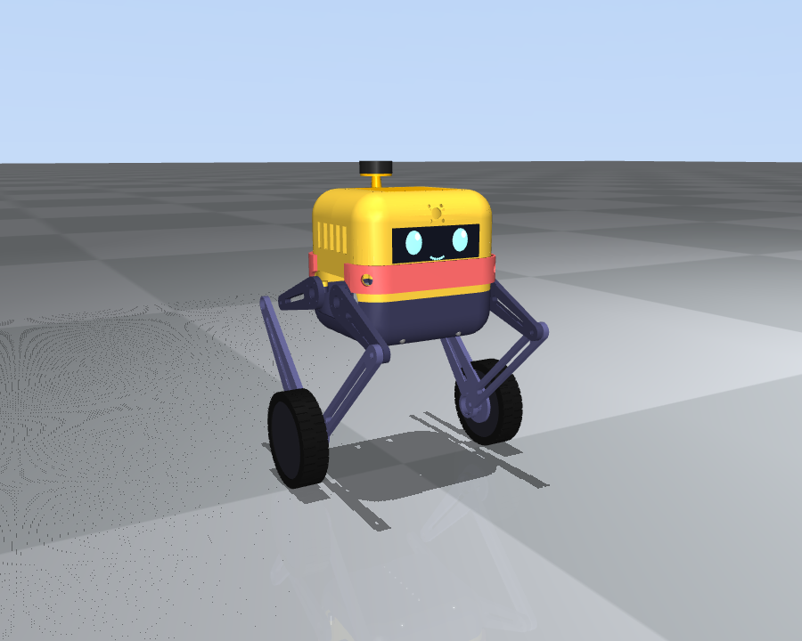
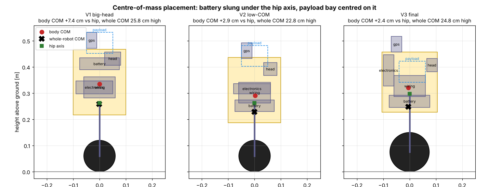
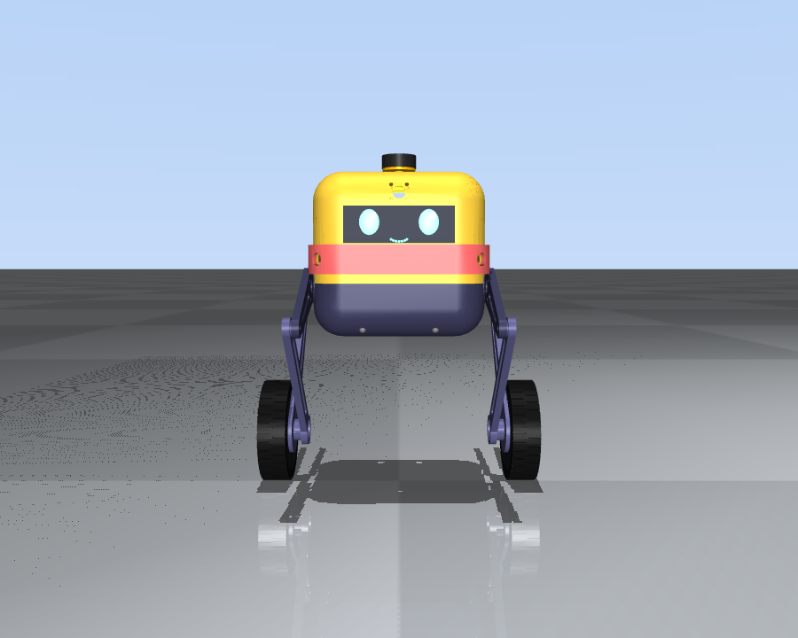
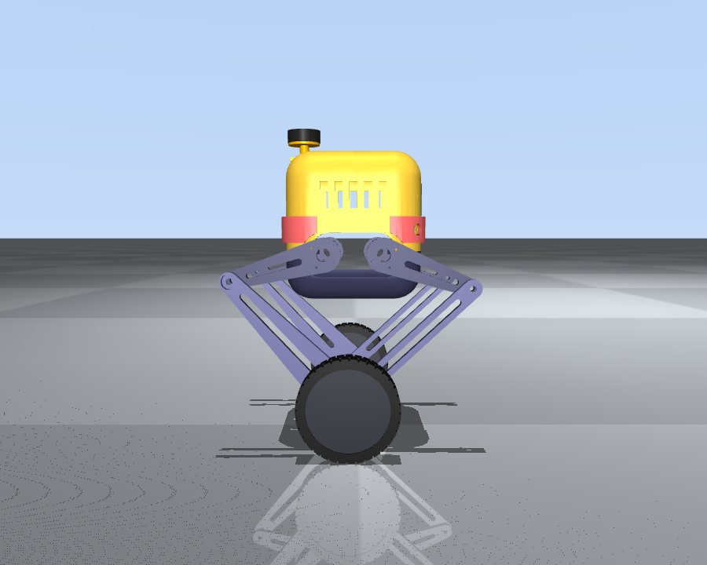
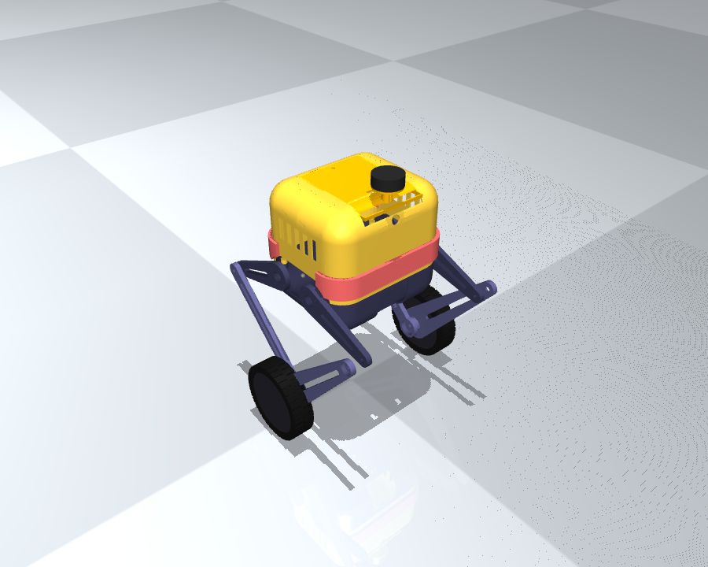

# 1 · Design overview — BOLT

BOLT is a **wheel‑legged balancing robot** in the spirit of Boston Dynamics' *Handle* and ETH's *Ascento*: two legs, each ending in a driven wheel. A leg can change length and angle, so the same machine can **balance like a Segway, crouch, crawl, lean, tilt and jump**.



| | |
|---|---|
| Mass | 6.4 kg (body 4.2 kg, legs + wheels 2.2 kg), payload up to 3 kg (sim‑verified), 2 kg design value |
| Size | body 210 × 240 × 230 mm, track 364 mm, overall width 404 mm |
| Height | 0.49 m standing · 0.42 m crawling · hip 0.21–0.39 m (adjustable) |
| Legs | planar 5‑bar per side: hip motors 90 mm apart, thigh 140 mm, shin 250 mm, virtual leg 0.13–0.35 m |
| Actuators | 4 × DM‑J4310‑2EC (hips, 7 Nm peak, CAN) + 2 × LK MF9025v2 hub motors (wheels, 4 Nm, CAN) |
| Wheels | 150 mm, printed PETG‑CF rim + TPU 95A tyre |
| Brains | Teensy 4.1 (1 kHz balance/legs) + Raspberry Pi 5 (vision, navigation, app, MAVLink) |
| Power | 6S LiPo 5000 mAh, slide‑in tray, hot‑swappable |
| Sensing | IMU ICM‑42688‑P, 2 × 220° fisheye cameras (360° view), 4 × ultrasonic, 2 × IR drop‑off sensors, GPS + compass (M10 puck) |

---

## 1.1 Why a wheel‑legged robot?

| Requirement | What the architecture gives |
|---|---|
| Balance on rough / inclined ground | Wheels balance (inverted pendulum); legs act as active suspension and keep the body level (roll compensation on side slopes, pitch on ramps). |
| Run fast | Wheels are 5–10× more efficient and faster than walking legs. |
| Jump steps / obstacles | Both hip motors of a leg push together → 80–165 N per leg (4–8× what it takes to hold the body) → 22 cm wheel clearance in simulation. |
| Tilt / crawl | Leg length 0.13–0.35 m and leg angle are independent → body pitch ±23°, roll ±15°, low crawl stance. |

A pure two‑wheeler can't jump or crawl; a quadruped is slow, heavy and complex. Two legs with wheels is the sweet spot.

## 1.2 Centre of mass — requirement 1

The balance law is an LQR on the "wheel + leg + body" pendulum (see [06_software.md](06_software.md)). What makes it robust on slopes and rough ground is **where the mass sits**:

1. **Fore–aft: on the hip axis.** Battery, payload bay and electronics are arranged so the body COM is within 5 mm of the hip axis in *x*. The leg then stands vertical at rest, the hip motors carry almost no static torque, and acceleration/braking is symmetric.
2. **Vertical: just above the hip axis (+24 mm).** The 780 g battery is slung *below* the hip axis between the hip motors; the payload bay sits *on* the axis. This keeps the body's pitch inertia small (fast attitude control, quick self‑levelling) and means rotating the body relative to the legs (tilt, bow, landing) costs almost no torque.
3. **Lateral: centred, wide track.** 364 mm track and a low whole‑robot COM (0.25 m) give a large lateral stability margin; on side slopes the legs differentially lengthen so the body stays level (sim: < 2° body roll on a 16° side slope).
4. **Leg mass at the top.** The hip motors are on the body, not on the legs (that's the point of the 5‑bar), so the legs are light (0.24 kg of printed links each) and swing fast.



The first sketch (V1, "big‑head" — battery and sensors up in the head for a cartoon look) had the body COM 74 mm above the hip; V2 moved the battery under the hip axis (+29 mm); V3 sank the payload bay into the body centre (+24 mm) and grew the wheels. See [04_simulation_report.md](04_simulation_report.md) for what each change bought.

## 1.3 Mechanical layout

```
          GPS puck (stub mast)          payload lid (magnetic)
               |                               |
      +--------+--------- shell (PETG) --------+--------+
      | electronics |      PAYLOAD BAY        | face     |
      |   SLED      |   120 x 124 x 110 mm    | screen,  |
      | (Pi 5,      |   centred on hip axis   | eyes,    |
      |  Teensy,    |                         | fisheye  |
      |  bucks)     |== hip motors (4) ===== =| sonar    |
      |             |  BATTERY 6S (slung low) |          |
      +-----------------  belly pan (PETG-CF) -----------+
             5-bar legs outside the side plates
```

* **Structural core**: two 8 mm PA‑CF side plates carry the four hip motors and are tied by a floor plate (with battery rails) and a top frame. The shell is cosmetic + protective and attaches with 6 × 3 mm magnets — no tools to open.
* **Legs**: per side two thighs (on the hip motors) and two shins meeting at the wheel axle; 608‑2RS bearings at knees and the foot joint; the rear shin carries the wheel motor stator.
* **Bumpers**: TPU 95A "cheeks" front and rear take falls and wall hits; the belly pan has TPU skid ribs.

### Cute character — requirement 3
BOLT is a chunky rounded box ("toaster‑bot") with a dark face screen, two glowing WS2812 ring **eyes** that change expression (normal, happy while jumping, sleepy when off, alert when blocked, angry on error), red bumper "cheeks", and a little antenna stub with the GPS puck. All parts print on a 256 mm bed without supports except the shell openings. See [05_print_and_build.md](05_print_and_build.md).

| front | side | rear / top |
|---|---|---|
|  |  |  |

## 1.4 Electronics that are handy to remove — requirement 2

* **Electronics sled**: a vertical cartridge (Raspberry Pi 5 on rubber grommets on one face, Teensy carrier with the IMU hard‑mounted + buck converters on the other). It slides into printed guides in the top frame, is clamped by two thumb screws (rigid, so the IMU sees the true body motion) and **pulls straight up** through the roof after lifting the magnetic cap. One 12‑pin locking connector (JST‑GH/Molex Micro‑Fit) + one XT30 carry everything — no loose wires.
* **Battery**: slide‑in tray from the rear with a snap latch; XT90‑S anti‑spark connector.
* **Payload bay**: separate magnetic lid; drain holes and tie‑down eyelets.
* **Motors**: each motor has its own XT30 + 4‑pin CAN JST‑GH pigtail, replaceable without opening the sled.

## 1.5 Cameras — requirement 4: maximum view with minimum cameras

Two **220° M12 fisheye** cameras (Arducam IMX219 NoIR), back‑to‑back at the top front (forehead, 10° down) and rear. Two 220° hemispheres overlap by 40°, so **two cameras see the full 360°** around the robot including the floor right in front of the wheels (needed for line following and step detection). The Pi 5 has exactly two CSI ports. NoIR sensors + 850 nm IR LEDs let them see in the dark.

## 1.6 Fast running without damaging the electronics — requirement 5

| Measure | Where |
|---|---|
| 150 mm wheels: 2 m/s at 70 % of motor no‑load speed (torque reserve for balance) | params / sim |
| Speed‑dependent ride height (lower when fast) and acceleration limit 2.5 m/s² | controller |
| Raspberry Pi on rubber grommets; IMU hard‑mounted but with its on‑chip anti‑alias filter (ODR/10) | CAD / firmware |
| TPU bumpers + TPU tyres (shock absorbing) | CAD |
| Soft landings: leg stroke kept for touchdown, damping doubled in the LAND phase | controller |
| 1000 µF low‑ESR + TVS on the motor bus (regen spikes when braking / landing) | wiring |
| Fall detection → motors limp (no thrashing into the ground) | controller |
| Separate always‑on logic supply; e‑stop only kills motor power | wiring |
| Motor CAN timeout (50 ms), Teensy watchdog (100 ms), Pi command timeout (300 ms) | firmware |
| Battery under‑voltage: slow down, then sit and switch motors off | firmware |

## 1.7 Requirement traceability

| # | Requirement | How BOLT does it | Verified in |
|---|---|---|---|
| 1 | COM for rough / inclined terrain | §1.2, gain‑scheduled LQR, roll levelling | sim: 25° ramps, 16° side slopes, 8 cm bumps at 1.5 m/s |
| 2 | Electronics easy to remove | §1.4 sled + tray + magnetic shell | CAD |
| 3 | Solid, cute, printable | PA‑CF structure, TPU bumpers, expressive eyes | CAD (all parts ≤ 256 mm, watertight STLs) |
| 4 | Cameras with max visibility | 2 × 220° fisheye = 360° | sim camera, line following |
| 5 | Run fast safely | §1.6 | sim: 2.0 m/s clean, turning 2 rad/s at 1.5 m/s |
| 6 | Jump steps / obstacles of variable height & distance | energy‑planned jump with edge‑distance timing | sim: step‑ups to 20 cm, hop 14 cm obstacle, flat jump 22 cm clearance (multi‑step stairs: see limits) |
| 7 | Tilt at variable angles / crawl | posture commands | sim: pitch ±23°, roll ±15°, crawl under 0.42 m |
| 8 | Carry a payload | sunken bay on the hip axis | sim: 3 kg drive + push |
| 9 | Avoid obstacles, run in the dark, follow coloured lines (no lidar) | sonar occupancy grid + A*, vision line follower + auto headlight/IR | SIL sim (real brain code) |
| 10 | Halt if no alternative path | local A* → turn‑and‑scan → road re‑route → HALT + report | SIL sim "boxed in" |
| 11 | Mission Planner GPS missions, shortest path | MAVLink rover endpoint + A* on a road graph | SIL sim with a pymavlink GCS |
| 12 | Phone controller: jump, dodge, tilt, climb… | PWA app served by the robot | headless browser test vs. sim |

## 1.8 Known limits (honest list)

* **Multi‑step stairs are not reliable.** Single steps/curbs up to 20 cm work every time in simulation at a 1 m/s approach. Consecutive hops need a 0.6 m+ landing between steps and even then fail intermittently on the final design (front knee clips the edge after a short run‑up). Normal house stairs (0.25–0.30 m treads) are **not** supported by this actuator set. Fix path: stronger hip actuators (e.g. DM‑J8009) for a standing‑start lunge jump, or a "knees‑back" leg variant.
* **Self‑righting** from lying flat is implemented but does not work yet in simulation — the robot goes limp (protecting itself) and waits for you to stand it up.
* **Autonomous step locating** (front camera → distance to a step edge) is experimental: accurate to ~2 cm at 0.5–0.9 m, but the full "Step up" action only works reliably when started ~0.7 m in front of the step.
* All results are **simulation** (MuJoCo + the real controller code + motor torque/speed limits + sensor noise/latency). Expect to re‑tune gains on the real robot ([06_software.md](06_software.md) §bring‑up).
* Motor bolt patterns, the MF9025 torque constant and CAN details are from datasheets of the versions I know; **verify against the batch you buy** (they're parameters in `cad/build_parts.py` and `firmware/src/config.h`).
