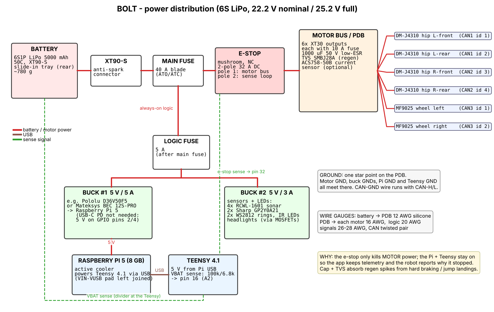
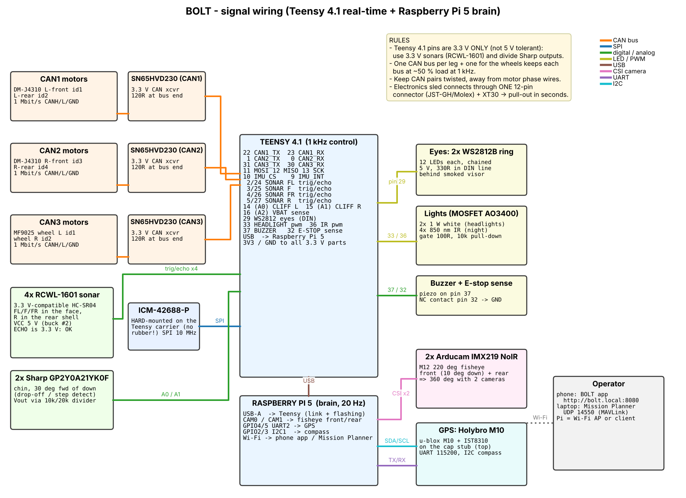

# 3 · Electronics, wiring and settings

Diagrams are generated by `electronics/make_diagrams.py` (SVG + PNG). Pin numbers come from `firmware/src/config.h` — if you change one, change both.

## 3.1 Power distribution



* **One star ground** on the PDB. Never ground the Pi or Teensy through a different path than their supply.
* The **e‑stop cuts only motor power**. Pi + Teensy stay alive (logic fuse is upstream of the e‑stop), so the app still shows telemetry and why the robot stopped. Pole 2 of the e‑stop opens a sense loop on Teensy pin 32 → the controller also commands zero torque.
* **Regen protection**: hard braking and jump landings push current back into the bus. The 1000 µF low‑ESR capacitor and the SMBJ28A TVS at the PDB clamp the spikes (DM motors are rated 24 V nominal; a full 6S pack is 25.2 V — do **not** go to 8S).
* Pi 5 is fed 5 V directly on GPIO pins 2/4 (5 V) and 6 (GND) from a 5 A buck. Add `usb_max_current_enable=1` to `config.txt` (see §3.5), otherwise the Pi limits USB current because there is no USB‑PD negotiation.

## 3.2 Signal wiring



### Teensy 4.1 pin map
| Pin | Function | Pin | Function |
|---|---|---|---|
| 22 / 23 | CAN1 TX / RX → left hips | 2 / 24 | sonar FL trig / echo |
| 1 / 0 | CAN2 TX / RX → right hips | 3 / 25 | sonar F trig / echo |
| 31 / 30 | CAN3 TX / RX → wheels | 4 / 26 | sonar FR trig / echo |
| 11 / 12 / 13 | SPI MOSI / MISO / SCK (IMU) | 5 / 27 | sonar Rear trig / echo |
| 10 / 9 | IMU CS / INT | 14 (A0) / 15 (A1) | Sharp cliff L / R (via 10k/20k divider) |
| 29 | WS2812 eyes DIN (330 Ω series) | 16 (A2) | VBAT sense (100k / 6.8k) |
| 33 | headlight PWM → AO3400 | 32 | e‑stop sense (INPUT_PULLUP, loop to GND) |
| 36 | IR LEDs PWM → AO3400 | 37 | buzzer |
| USB | Raspberry Pi (link + power + flashing) | 3V3 | IMU, CAN transceivers, sonar logic |

> Teensy 4.1 I/O is **3.3 V only**. That's why the sonars are RCWL‑1601 (3.3 V HC‑SR04 variant) and the Sharp outputs go through a divider.

### Raspberry Pi 5 connections
| Pi | Connected to |
|---|---|
| USB‑A (any) | Teensy 4.1 micro‑USB → `/dev/ttyACM0` |
| CAM0 / CAM1 (22‑pin) | front / rear fisheye camera |
| GPIO4 (TXD2) / GPIO5 (RXD2) | GPS RX / TX (UART2 → `/dev/ttyAMA2`) |
| GPIO2 (SDA1) / GPIO3 (SCL1) | GPS puck compass IST8310 (I²C 0x0E) |
| pins 2/4 + 6 | 5 V / GND from buck #1 |
| Wi‑Fi | phone app + Mission Planner |

### CAN buses
* **3 buses at 1 Mbit/s**: CAN1 = left hip motors (IDs 1, 2), CAN2 = right hip motors (IDs 3, 4), CAN3 = wheel motors (IDs 1, 2). At 1 kHz each bus carries 4 frames/ms ≈ 50 % load.
* Daisy chain each bus with twisted pair + a GND wire. **120 Ω at both ends**: most SN65HVD230 breakouts already have one (keep it at the Teensy end) and put one at the last motor (DM motors have a termination switch / solder pad).

## 3.3 Motor settings

### DM‑J4310‑2EC (Damiao debugging assistant, USB‑CAN adapter)
| Setting | Value |
|---|---|
| Control mode | **MIT** |
| CAN ID (slave) | 0x01 L‑front, 0x02 L‑rear, 0x03 R‑front, 0x04 R‑rear |
| Master ID (feedback) | 0x11 / 0x12 / 0x13 / 0x14 |
| Baud | 1 Mbit/s |
| PMAX / VMAX / TMAX | 12.5 rad / 30 rad/s / 10 Nm |
| CAN timeout | 50 ms (motor disables itself if commands stop) |
| Over‑temperature | 80 °C (default) |

Firmware sends pure torque (`kp = 0`, small `kd = 0.02` for smoothness). **Direction**: `HIP[i].sign` in `config.h` maps motor rotation to the controller's φ convention (CCW in the leg plane seen from the robot's right). After calibration, run `bolt_cli.py status`, move a leg by hand: extending the leg must *increase* L.

### LK‑TECH MF9025v2 (LK motor tool)
| Setting | Value |
|---|---|
| ID | 1 = left, 2 = right (frame id 0x141 / 0x142) |
| Bus | CAN, 1 Mbit/s |
| Control | torque loop, command 0xA1 (iq) |
| Protection | enable "communication interruption" stop (100 ms) |
| Firmware constants | `WHEEL_KT` (Nm/A) and `WHEEL_IQ_FULLSCALE_A` — **check your datasheet**; wrong values only scale the gains, but check the sign: positive wheel torque must roll the robot forwards |

## 3.4 Firmware settings (`firmware/src/config.h`)
* `CONTROL_HZ 1000`, `TELEMETRY_HZ 100`, `CMD_TIMEOUT_S 0.3` (no command → stop and hold balance).
* `CAL_PHI1/CAL_PHI4`: thigh angles in the calibration pose (legs folded on the printed end stops). Computed from the kinematics; don't change unless you change the legs.
* `BATT_LOW_V 21.0` (slow down), `BATT_CRIT_V 19.8` (motors off).
* `IMU_AXIS_MAP / IMU_AXIS_SIGN`: map the IMU chip axes to body axes (x forward, y left, z up).
* Gains: `firmware/lib/bolt_core/robot_config_generated.h` is **generated** by `python3 sim/lqr_design.py` — edit `design/params.py` / the weights in `sim/lqr_design.py`, not the header.

## 3.5 Raspberry Pi OS (Bookworm 64‑bit)
`/boot/firmware/config.txt` additions:
```ini
# cameras (two IMX219 on CAM0/CAM1)
camera_auto_detect=0
dtoverlay=imx219,cam0
dtoverlay=imx219,cam1
# GPS on UART2 (GPIO4/5) -> /dev/ttyAMA2, compass on I2C1
dtoverlay=uart2-pi5
dtparam=i2c_arm=on
# powered through the GPIO 5 V pins by a 5 A buck
usb_max_current_enable=1
```
Then:
```bash
sudo hostnamectl set-hostname bolt          # app at http://bolt.local:8080
sudo apt install -y python3-opencv python3-picamera2 python3-serial python3-yaml python3-aiohttp python3-numpy
pip install --break-system-packages pymavlink
sudo usermod -aG dialout,video bolt
# Wi-Fi hotspot for the field (phone + laptop join "BOLT"):
sudo nmcli dev wifi hotspot ifname wlan0 ssid BOLT password "bolt-robot"
sudo cp companion/systemd/bolt.service /etc/systemd/system/ && sudo systemctl enable --now bolt
```

## 3.6 GPS (u-blox M10, u‑center 2, once)
* UART1 baud **115200**, output **NMEA** GGA + RMC + GSA (disable GSV/GLL/VTG to save bandwidth).
* Navigation rate **10 Hz** (M10 supports 10 Hz with GPS+Galileo+BeiDou; drop GLONASS if needed).
* Dynamic platform model **Pedestrian** (good for ≤ 3 m/s ground robots), SBAS on.
* Save configuration to flash/BBR.
* Mount the puck on the cap stub (top of the robot) — as far from the motors as possible; the compass (IST8310) is optional for BOLT (heading is fused from IMU yaw + GPS course).

## 3.7 Mission Planner (ArduPilot GCS)
1. Laptop joins the robot's Wi‑Fi (or the same LAN). In `companion/config.yaml` set `mavlink.url` to `udpout:<laptop-ip>:14550` (or keep the broadcast default).
2. Mission Planner → top right: **UDP**, port **14550**, Connect. BOLT appears as a *Rover* (sysid 1) on the map with heading, speed, GPS and battery.
3. **Plan** tab → set Home, click waypoints → **Write WPs**. Supported: `WAYPOINT`, `LOITER_TIME`, `RETURN_TO_LAUNCH`, `CONDITION_DELAY`, `DO_JUMP`, `DO_CHANGE_SPEED`, plus `USER_1` (BOLT jump: p1 height m, p2 0=onto/1=over), `USER_2` (height/crawl), `USER_3` (tilt: p1 pitch°, p2 roll°).
4. **Data** tab → Actions: **Arm**, mode **Auto** (or "Mission Start"). `Hold` pauses, `RTL` returns home, right‑click → **Fly to here** = GUIDED go‑to.
5. Between waypoints BOLT drives the **shortest route over the road graph** (`companion/maps/roads.geojson`, export OSM `highway=*` lines for your area with QGIS/overpass‑turbo) with A*; it detours around obstacles, re‑routes around blocked roads and **halts with a status text** if no alternative exists.

## 3.8 First‑time calibration
1. Power with the **e‑stop pressed** (motors unpowered), connect to the Pi: `sudo systemctl stop bolt`.
2. `python3 tools/bolt_cli.py calibrate` with both legs folded against the printed end stops → offsets stored in Teensy EEPROM. The eyes stop being "angry" (uncalibrated) and turn normal.
3. `python3 tools/bolt_cli.py status`: tilt the robot nose‑down → pitch must go **positive**; roll left side up → roll positive; extend a leg by hand → L increases.
4. `tools/bolt_cli.py sonar` → check all four sonars and both cliff sensors.
5. Release the e‑stop, hold the robot upright on the floor, `tools/bolt_cli.py balance 10`. It should stand still; if it runs away, a sign in `config.h` is wrong (wheel or hip `sign`, or IMU map).
