# 4 · Simulation, testing and design iterations

## 4.1 How the robot was simulated

* **Physics**: MuJoCo 3 (0.5 ms step, implicit integrator, elliptic friction cones). The model (`sim/robot_model.py`) is generated from `design/params.py` and the CAD mass report: a floating body, **closed‑chain 5‑bar legs** (equality constraints), real tyre/ground contact, the GPS puck and shins as colliders.
* **Controller = firmware**: `firmware/lib/bolt_core/bolt_controller.cpp` is compiled into a shared library and called through ctypes at 1 kHz — the simulator runs the exact code that is flashed onto the Teensy.
* **Realism added**: linear torque–speed envelopes of both motor types (back‑EMF limits), one control period of CAN latency, IMU/encoder noise, a speed‑dependent wheel velocity estimate, simulated ultrasonic cones, IR cliff sensors, a rendered front camera and a wandering virtual GPS.
* **Brain in the loop** (`sim/companion_sim.py`): the real Raspberry Pi code (`companion/robot_brain`) drives the simulated robot — line following from rendered images, A* obstacle detours, Mission Planner missions over real MAVLink/UDP, and the phone app over WebSocket.

Reproduce everything: see [06_software.md §6.5](06_software.md).

## 4.2 Design iterations

| | V1 "big head" | V2 "low COM" | V3 final |
|---|---|---|---|
| Idea | cartoon proportions: battery + sensors in the head | battery slung under the hip axis, wider track (300 → 364 mm) | 150 mm wheels, longer shins (jump stroke), payload bay sunk onto the hip axis, printed parts from CAD |
| Body COM above hip axis | +74 mm | +29 mm | +24 mm |
| Whole‑robot COM height | 0.26 m | 0.23 m | 0.25 m |
| Wheel Ø | 120 mm | 120 mm | **150 mm** |
| Mass | 5.7 kg | 5.7 kg | 6.4 kg |

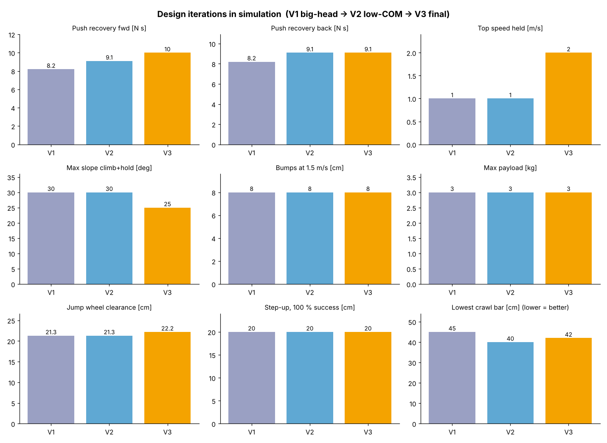

What each step bought (from the test suite, same controller design procedure for all variants):

* **V1 → V2 (lower COM)**: clean push recovery 8.2 → 9.1 N·s; the body attitude loop gets less disturbed by leg motion; lower crawl (45 → 40 cm bar). 
* **V2 → V3 (bigger wheels, longer legs, centred payload)**: **safe top speed 1.0 → 2.0 m/s** — with 120 mm wheels the hub motors hit their back‑EMF limit near 2 m/s, run out of balancing torque and the robot runs away (V1 tips over at 34°, V2 reaches 3 m/s out of control). With 150 mm wheels 2 m/s uses ~70 % of the motor speed and the robot tracks 2.0 m/s with < 0.5° body pitch. Also push recovery 10 N·s forward, flat‑jump wheel clearance 21 → 22 cm.
* **The price**: the same motor torque on a larger wheel gives less traction force, so the steepest ramp it climbs *and* holds drops from 30° to 25° (still above the 20° target), and V3 is 0.7 kg heavier.
* **Unchanged across variants**: 8 cm bumps at 1.5 m/s, 3 kg payload, ±23° pitch / ±15° roll, 20 cm step‑ups — these are set by the controller and the leg actuators, not by these geometry changes.

### Controller iterations (found by the tests, fixed in the firmware)
| Problem seen in simulation | Fix in `bolt_controller.cpp` |
|---|---|
| First jump: abrupt crouch tipped the leg, thrust ended early, touchdown never detected → fall | smooth crouch ramp, wait until legs are vertical, energy‑planned thrust over the full stroke |
| Touchdown falsely detected mid‑air from internal leg forces (accelerometer) | touchdown = leg compression while the detector is armed after apex |
| Body spins nose‑down after take‑off | feed‑forward hip torque cancelling the leg force's moment about the body COM; wheel torque limited during thrust; legs held in the body frame in flight |
| Wheels clipped the step lip after extending for landing | separate jump modes: *onto a step* (stay tucked) vs *over an obstacle* (extend after apex) |
| Narrow timing window for step jumps (crouch duration varies) | controller times the take‑off from the edge distance + its own odometry; aborts instead of hitting the riser |
| Front knee strikes the step edge | take‑off distance includes the knee overhang (`JUMP_EDGE_MARGIN`) |
| Robot overshoots speed commands after braking ("catch‑up") | position reference re‑anchored when starting/reversing, kept when stopping (still holds on slopes) |
| Turns at half the commanded rate (tyre scrub) | yaw‑rate PI instead of P |
| Push test passed while legs had flailed through 120° | stricter test: must settle back to a calm stance → honest 10 N·s figure |

## 4.3 Final design (V3) results

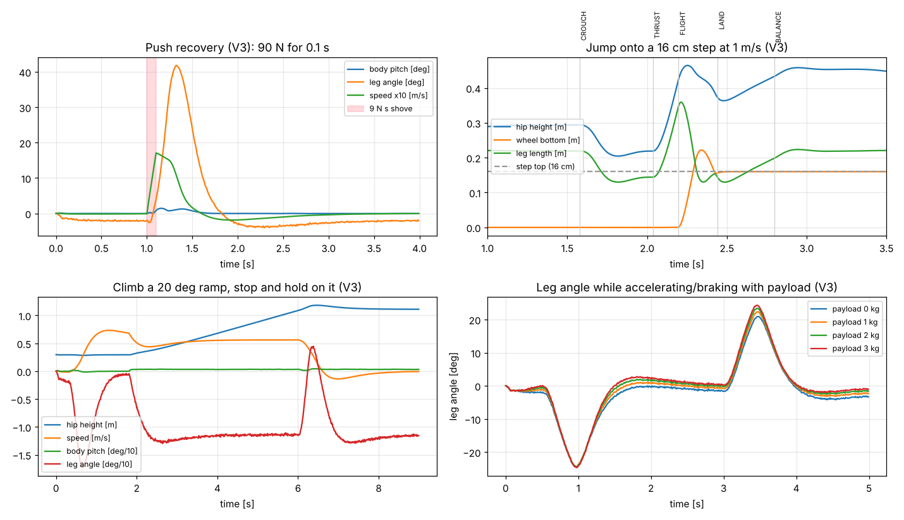

| Test (requirement) | Result | |
|---|---|---|
| Static balance (1) | 0.02° RMS pitch, 4 mm drift with sensor noise | ✅ |
| Push recovery, clean (1, 5) | 10 N·s forward / 9 N·s backward (≈ 1.5 m/s kick) | ✅ |
| Top speed (5) | 2.0 m/s tracked, < 0.5° pitch; 2.4 m/s runs away (motor limit) | ✅ |
| Turning at speed (5) | 2 rad/s at 1.5 m/s, 0.2° body roll | ✅ |
| Ramps (1) | climbs **and holds** 25°; 30° fails | ✅ |
| Side slopes (1) | 16° side slope, body kept within 1.8° of level | ✅ |
| Rough ground (1) | 8 cm random bumps at 1.5 m/s; 11 cm at 0.8 m/s | ✅ |
| Payload (8) | 3 kg in the bay: drives 1 m/s and survives an 8 N·s push | ✅ |
| Tilt (7) | pitch −23…+23°, roll ±15°, hip height 0.21–0.39 m | ✅ |
| Crawl (7) | passes under a 0.42 m bar | ✅ |
| Jump (6) | 22 cm wheel clearance, planned vs achieved within ~1 cm up to the motor limit | ✅ |
| Step‑up at 1 m/s (6) | **100 %** for 8, 12, 16, 20 cm (3 request distances each); 22 cm 1/3 | ✅ |
| Hop over an obstacle (6) | 6, 10, 14 cm high bars | ✅ |
| Stairs, 3 steps (6) | ❌ on V3 (V1/V2 manage 0.6 m treads); standard 0.25–0.30 m treads fail on all | ❌ |
| Self‑righting | ❌ experimental, robot goes limp and waits | ❌ |

| Step‑up onto 16 cm | Hop over a 14 cm bar | 8 cm bumps at 1.5 m/s | Crawl under 0.42 m |
|---|---|---|---|
| 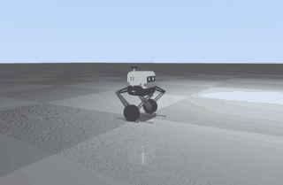 | 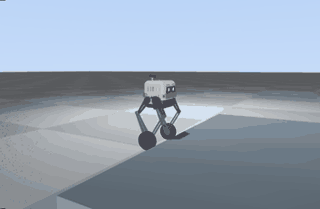 | 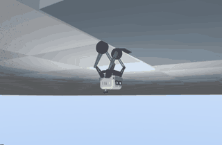 | 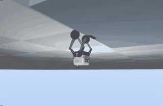 |

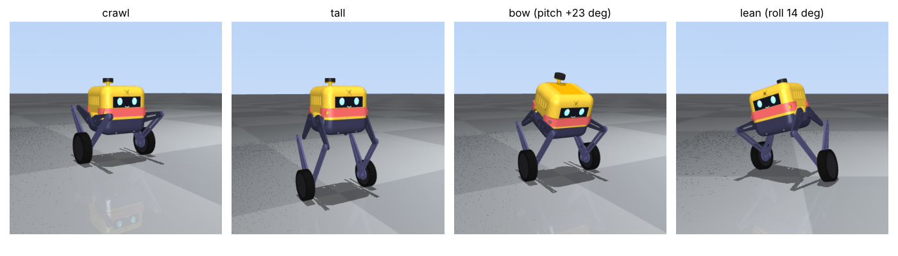

## 4.4 Brain‑in‑the‑loop results (requirements 9–12)

| Scenario | Result |
|---|---|
| **Line following**, red line with S‑bends, daylight | 26.5 m in 40 s, **2.6 cm mean** / 21 cm max deviation |
| **Line following in the dark** | headlight + IR switched on automatically, 2.6 cm mean deviation |
| **Obstacle detour** (wall across the path, gap at the side) | A* detour, goal reached |
| **Boxed in** (goal unreachable) | scans 360°, then **HALT: "no alternative path"** reported to app/GCS |
| **Mission Planner mission** (pymavlink GCS: upload 4 items, arm, start) over a street grid, broken‑down van on the shortest route | shortest street routes, local detour around the blocked street via the next block, **mission complete**; GCS sees position/heading/status texts throughout |
| **Phone app** (headless Chromium vs. the simulated robot) | connect, drive 1.3 m/s, Jump → CROUCH/THRUST/FLIGHT/LAND, crawl, waypoint, E‑STOP; no JS errors |
| **Vision step locator** (camera → distance to a step edge) | ≤ 2 cm error 0.5–0.9 m away; full "Step up" action works when started ~0.7 m from the step (3/3 heights); from other start distances unreliable (own shadow, edge mis‑pairing at long range) → **experimental** |

| line following (day) | at night (auto headlight) | what the robot's camera sees |
|---|---|---|
| 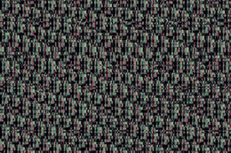 | 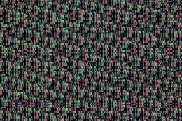 | 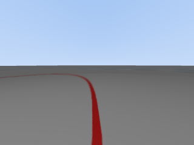 |

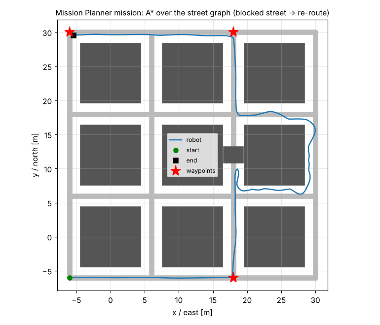

| detour | boxed in → HALT |
|---|---|
| 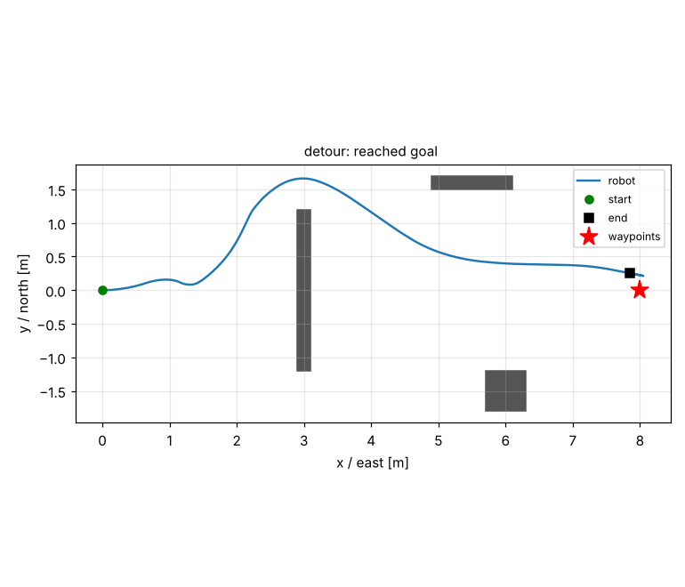 | 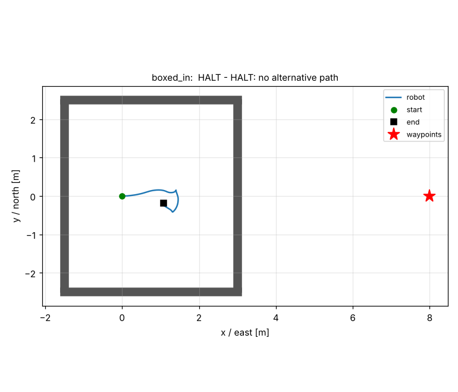 |

## 4.5 What simulation can't tell you
Tyre/ground friction, gearbox backlash, CAN timing jitter, cable drag on the legs, real fisheye distortion and lighting, and printed‑part flex are idealised. Plan on re‑tuning the leg spring/damper and the LQR weights on the real robot, and start jumping at low heights on soft ground. The gains are regenerated in seconds from `design/params.py` once you weigh the real parts.

## 4.6 Next steps (to close the open items)
1. **Stairs**: stronger hip actuators (e.g. DM‑J8009, ~3× torque) → standing‑start lunge jumps; or knees‑back legs so the knee doesn't overhang the wheel.
2. **Self‑righting**: a dedicated motion (swing both legs over the head to lever the body) — needs leg‑vs‑shell clearance checks in CAD first.
3. **Step locator**: higher camera resolution for the locator crop, fisheye undistortion, temporal edge tracking that rejects the robot's own shadow.
