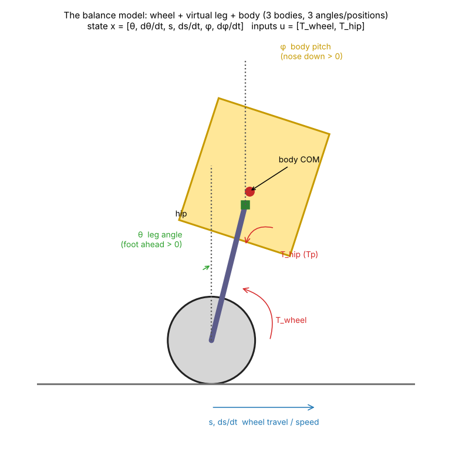
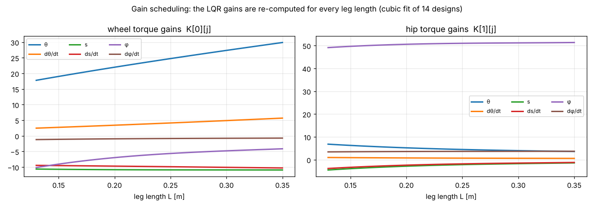
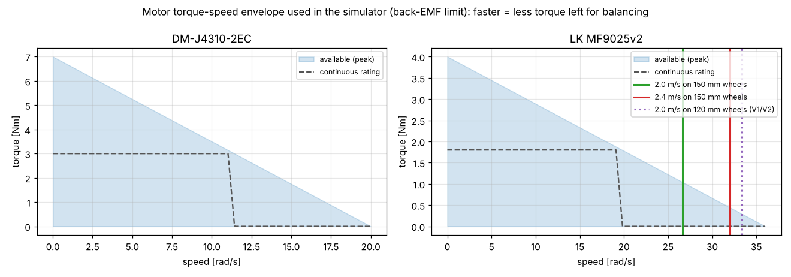
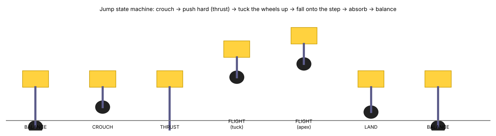

# Chapter 2 — The physics behind BOLT

No prior control theory is assumed. Each section starts with the intuition, then gives the equations used in the code, then the actual numbers for BOLT.

## 2.1 Why a two‑wheeled robot falls

Stand a broom on your palm. If it leans a little, gravity pulls its top further over — the lean **grows by itself**. That is an *inverted pendulum*: an unstable system. For a stick of height *h* the lean grows roughly like `e^(t/τ)` with `τ = √(h/g)`. For BOLT's centre of mass (≈ 0.26 m high) `τ ≈ 0.16 s`: left alone, a 1° lean becomes 20° in about half a second. The controller must react many times faster than that — BOLT's loop runs every **1 ms**.

## 2.2 How wheels catch the fall

To keep a broom up you move your hand **under** it. BOLT does the same with its wheels: if the body leans forward, the wheels accelerate forward until they are back under the centre of mass (COM). The wheel motor pushes on the ground through friction; the ground pushes back on the robot.

A surprising consequence: **to drive forward, BOLT must first roll slightly backwards.** It has to lean forward before it can accelerate forward, and the only way to create that lean is to move the wheels back for an instant. Engineers call this *non‑minimum‑phase* behaviour. You can see it in the gains: the position gain has the "wrong" sign (§2.5).

## 2.3 The model the controller is designed on



The full robot has dozens of moving parts, but for balancing it behaves like three bodies in the side view:

* the **wheel** (both wheels together), rolling without slipping;
* the **virtual leg**: a straight rod from the wheel axle to the hip. Its length is L and its angle from vertical is θ (θ > 0 when the foot is ahead of the hip);
* the **body**, hinged at the hip, tilted by the pitch φ (φ > 0 when the nose goes down).

The robot is described by 3 positions and their 3 speeds: **x = [θ, θ̇, s, ṡ, φ, φ̇]**, where s is how far the wheels have rolled. It has two "levers" (inputs) **u = [T_wheel, T_hip]**: the wheel motor torque, and the hip torque between leg and body.

### Equations (Lagrangian mechanics, as coded in `sim/lqr_design.py`)
Positions in the side view (x forward, z up), with W the wheel centre:

```
W        = (s, R)
leg COM  = W + l_w·(−sin θ, cos θ)                    (l_w = 6.7 cm above the axle)
hip H    = W + L·(−sin θ, cos θ)
body COM = H + (b_x cos φ + b_z sin φ,  −b_x sin φ + b_z cos φ)   (b_x = −5 mm, b_z = +24 mm)
```
* Kinetic energy T = ½ m_w ṡ² + ½ I_w (ṡ/R)² + ½ m_l |v_leg|² + ½ I_l θ̇² + ½ m_b |v_body|² + ½ I_b φ̇²
* Potential energy V = g·(m_l·z_leg + m_b·z_body)
* Generalised forces: the wheel motor turns the wheel relative to the leg, and the hip torque acts between leg and body:

  `Q_θ = T_wheel + T_hip,   Q_s = T_wheel / R,   Q_φ = T_hip`

Lagrange's equation `d/dt(∂T/∂q̇) − ∂T/∂q + ∂V/∂q = Q` gives `M(q)·q̈ + (gravity terms) = Q`. Near the upright pose the speeds are small, so we **linearise**: `q̈ ≈ M⁻¹(K·q + B·u)`. In state‑space form:

```
ẋ = A x + B u        (6×6 matrix A, 6×2 matrix B)
```
The code does this numerically: it builds the energy functions, differentiates them with tiny finite differences, and gets A and B. **All the masses come from the MuJoCo model** (body 4.20 kg, legs 1.19 kg, wheels 1.04 kg, body pitch inertia 0.027 kg·m²…), and those come from the CAD. If the CAD changes, the controller changes with it.

## 2.4 LQR — choosing the gains automatically

The controller is a simple rule: **u = −K·x** (each torque is a weighted sum of the 6 state values). The question is which 12 numbers to put in K. *LQR* (Linear‑Quadratic Regulator) picks the K that minimises

```
J = ∫ ( xᵀ Q x + uᵀ R u ) dt
```
Q says how much you dislike each kind of error, R how much you dislike using torque. BOLT uses
`Q = diag(40, 1, 120, 25, 900, 4)` for [θ, θ̇, s, ṡ, φ, φ̇] and `R = diag(1, 0.35)`. The 900 on φ means "keep the body level above all". The 120 on s means "don't drift away". SciPy solves the Riccati equation (`solve_continuous_are`) and returns K. You never tune 12 gains by hand, only 8 weights with clear meanings.

The result is stable: the slowest closed‑loop pole is at −2.6 s⁻¹, so disturbances decay with a time constant of about 0.4 s.

## 2.5 Reading the gains (L = 0.22 m)

| | θ | θ̇ | s | ṡ | φ | φ̇ |
|---|---|---|---|---|---|---|
| wheel torque | 22.7 | 3.6 | −10.8 | −9.7 | −6.6 | −0.9 |
| hip torque | 5.0 | 0.75 | −2.6 | −2.2 | 50.7 | 3.6 |

* `T_wheel = −22.7·θ…`: if the foot is ahead (θ > 0, robot falling backwards), the wheels drive backwards to get under it.
* The **s gain is negative**: if the robot is ahead of where it should be, the wheels first push it *further forward* to make it lean back, then it rolls back. This is the non‑minimum‑phase effect from §2.2.
* The hip gain on φ is large (50.7 Nm/rad): the hips are what keep the body level, so the legs do the leaning instead.

## 2.6 Gain scheduling

A short pendulum falls faster than a long one, so the best gains depend on L. The design is repeated for 14 leg lengths between 0.12 and 0.36 m. Each gain is fitted with a cubic polynomial in L and stored in `firmware/lib/bolt_core/robot_config_generated.h`. In the firmware, `Controller::gains(L)` evaluates the polynomials every millisecond.



## 2.7 Tilting the body on purpose

To bow forward by φ_ref, the body's COM moves forward of the hip by `x_w = b_x cos φ + b_z sin φ`. To stay balanced, the whole robot's COM must stay above the wheel, so the leg must lean the other way:

```
sin θ_eq = m_b·x_w / ((m_b + ½ m_leg)·L)        T_hip,eq = −m_b·g·x_w
```
The controller adds T_hip,eq as a feed‑forward and regulates around θ_eq (`Controller::equilibrium`). Because BOLT's body COM is only 24 mm from the hip axis, holding a ±23° tilt costs very little torque. That is the main reason the COM was placed there.

## 2.8 The legs as springs (virtual model control)

The leg length isn't part of the LQR model. Each leg is controlled as if it were a **virtual spring‑damper**:

```
F = F_ff + k·(L_ref − L) − c·L̇        F_ff = (m_b·g/2) / cos θ      (gravity feed‑forward)
k = 900 N/m,  c = 45 N·s/m
```
With half the body (2.1 kg) on each leg, the bounce frequency is √(k/m) ≈ 21 rad/s (3.3 Hz) and the damping ratio is c/(2√(k·m)) ≈ 0.5: firm but not harsh. It acts like active suspension over bumps. Chapter 3 shows how F becomes motor torques.

## 2.9 Side slopes and leaning (roll)

On a sideways slope of angle α the uphill wheel is higher. Keeping the body level needs one leg longer by `ΔL ≈ track·tan α` = 0.364·tan 16° ≈ 10 cm (well inside the 22 cm leg range). The roll controller adds `±F_roll` to the two leg forces:

`F_roll = k_r·(roll_ref − roll) − d_r·roll_rate + k_i∫(roll_ref − roll)` with 250 / 18 / 120.

The integral term removes the steady error caused by the slope. Commanding `roll_ref ≠ 0` gives the "lean" feature.

## 2.10 Turning

Turning at speed v with yaw rate ω needs a sideways (centripetal) acceleration `a = v·ω`. At 1.5 m/s and 2 rad/s that is 3 m/s². The body tends to roll outwards. The outer leg pushes extra by `ΔF = m_b·a·h/track` ≈ 4.2·3·0.26/0.36 ≈ 9 N (`F_turn` in the code). Yaw itself is controlled by giving the wheels different torques (`±T_yaw`) with a PI controller on yaw rate. The integral part was added because tyre scrub made the robot turn at only half the commanded rate (chapter 5).

## 2.11 Slopes

On a ramp of angle α, holding still needs a wheel torque of `m·g·sin α·R`. At 25° that is 6.4·9.81·0.42·0.075 ≈ 2.0 Nm total (1 Nm per wheel, peak available 4 Nm). The tyres must not slip: that needs friction μ > tan α = 0.47 (rubber‑like TPU on asphalt is ~0.8). The controller finds this torque by itself: the position error (s − s_ref) grows until `K_s·error` equals it. This acts like an integral term.

## 2.12 Motors have a speed limit (back‑EMF)

A motor turning faster generates a voltage that opposes the battery, so the available torque falls roughly linearly to zero at the no‑load speed:

`τ_available ≈ τ_peak·(1 − ω/ω_max)`



This is why wheel size mattered (chapter 5). At 2 m/s, 120 mm wheels spin at 33 rad/s, which is 93 % of the MF9025's 36 rad/s limit, so almost no torque is left to balance and the robot runs away. 150 mm wheels spin at 27 rad/s (74 %), which leaves enough torque. The simulator applies this envelope to every motor every step.

## 2.13 Jumping — energy bookkeeping



To clear a step of height h, the **bottom of the wheel** must rise above h (+5 cm margin). Two things lift the wheel:

1. the robot's COM flies up by `h_com = v_com²/(2g)`;
2. after take‑off the legs retract (from 0.338 to 0.15 m). Pulling the light wheels up toward the heavy body raises the wheels relative to the COM by `ΔL·m_body/m_total`.

So `h_com = h + 0.05 − (0.338 − 0.15)·4.2/6.4`. Example for a 16 cm step:

```
retraction gain = 0.188 × 0.653 = 0.123 m
h_com  = 0.16 + 0.05 − 0.123 = 0.087 m
v_com  = √(2·9.81·0.087) = 1.31 m/s
body speed at take-off = v_com × m_total/m_body = 2.0 m/s
thrust: (2F − m_b g)·(0.4 × stroke) = ½ m_b v²  →  F ≈ 82 N per leg (+10 % margin)
time to apex = v_com/g = 0.13 s
```
The 82 N matches what the simulator logged. The maximum leg force available is 77–165 N depending on L (chapter 3), which is why the wheel clearance tops out around 22 cm.

**Take‑off timing.** The wheel must be above the step before it reaches the edge. During the thrust (~0.15 s) and the climb (~0.1 s) the robot keeps rolling at v, so the controller fires when the remaining distance equals `v·(t_thrust + t_clear) + R + margin`.

**Landing.** In flight nothing pushes on the legs, so any sudden compression means "ground". When it is detected the controller doubles the damping and eases the legs back to normal height over 0.35 s, like bending your knees when you land.

**Body spin.** The leg force passes through the hip, a few millimetres from the body COM. At 300 N even 5 mm makes a 1.6 Nm twist, which spun the body in early tests. The fix is a feed‑forward hip torque that cancels it: `T_ff = −F·(b_z sin θ_b + b_x cos θ_b)`.

## 2.14 Wheel speed and odometry

Rolling without slipping: ground speed = R × (wheel angular speed relative to the ground). The wheel motor measures speed relative to the **shin** it is mounted on, and the shin itself rotates when the leg moves or the body pitches. So:

`ṡ = R·(ω_motor + pitch_rate − α̇_shin)`

where α̇_shin comes from the 5‑bar kinematics. Forgetting this term makes the robot think it moves every time it crouches.

## 2.15 Knowing which way is up (IMU fusion)

The IMU has a gyroscope (accurate but drifts slowly) and an accelerometer (knows where gravity is, but is noisy and confused by accelerations). The **Mahony filter** (`firmware/lib/bolt_drivers/attitude.h`) integrates the gyro and gently pulls the estimate toward the accelerometer's "down". When the accelerometer reads far from 1 g (jumps, impacts) it is ignored. The gyro bias is measured during one second of standing still at power‑up.
