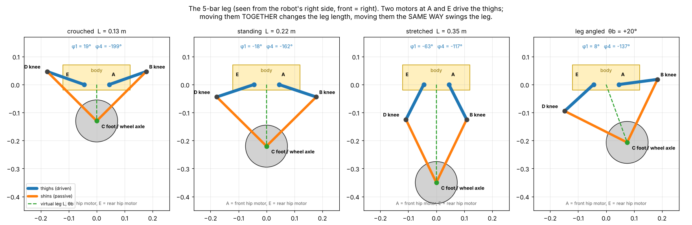
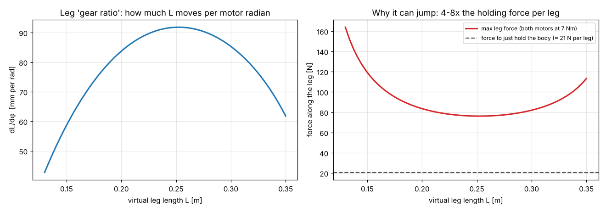

# Chapter 3 — The mechanism: how the legs, wheels and body work

## 3.1 The parts of one leg



Each side of the robot has one **5‑bar linkage**. Counting the bars:

| Bar | What it is | Length |
|---|---|---|
| 1 (ground link) | the body between the two hip motors A (front) and E (rear) | l5 = 90 mm |
| 2 | **front thigh** A→B, bolted to the front hip motor | l1 = 140 mm |
| 3 | **front shin** B→C | l2 = 250 mm |
| 4 | **rear shin** D→C | l2 = 250 mm |
| 5 | **rear thigh** E→D, bolted to the rear hip motor | l1 = 140 mm |

Joints: A and E are the two **motors**. B and D are **knees** with 608 ball bearings and M8 pins. C is the **foot**, where both shins meet on the wheel axle. The rear shin carries the wheel motor; the front shin rides on a boss of the rear shin with its own bearing.

### Why does it have exactly two degrees of freedom?
Grübler's formula for planar mechanisms: `DOF = 3(n − 1) − 2j`, with n = 5 bars and j = 5 pin joints → `3·4 − 2·5 = 2`. Two motors, two degrees of freedom, so the foot position (x, z) is **fully decided** by the two motor angles. Nothing flops around.

### Why this design instead of a hip + knee motor?
* Both heavy motors (300 g each) sit on the **body**. The leg is only ~240 g of printed links, so it swings and extends very fast, which is what jumping needs.
* Both motors **share** the load: pushing the leg straight down uses both at once (twice the force).
* The geometry acts like a variable gearbox: when crouched the leg is "geared down" (strong, slow), when stretched it is "geared up" (fast).

## 3.2 Forward kinematics: from motor angles to foot position

Angles φ1 (front thigh) and φ4 (rear thigh) are measured from the forward direction, counter‑clockwise in the side view. The code is `design/kinematics.py → forward()` and its C++ twin `firmware/lib/bolt_core/five_bar.h → five_bar_fk()`.

1. Knees: `B = A + l1·(cos φ1, sin φ1)`, `D = E + l1·(cos φ4, sin φ4)`.
2. The foot C is l2 away from **both** B and D, so it is where two circles of radius l2 around B and D intersect. Let `M` = midpoint of BD and `d` = |BD|; then `h = √(l2² − d²/4)`, and C = M + h × (unit vector perpendicular to BD). Of the two intersections, take the one **below** the knees.
3. The **virtual leg**: `L = |C|` (distance from the hip midpoint to the foot) and `θ_b = atan2(C_x, −C_z)`.

**Worked example (standing):** φ1 = −18.4°, φ4 = −161.6°

```
B = (0.045 + 0.140·cos(−18.4°), 0.140·sin(−18.4°)) = (0.178, −0.044)
D = (−0.178, −0.044)            M = (0, −0.044),  d = 0.356
h = √(0.25² − 0.178²) = 0.176   C = (0, −0.044 − 0.176) = (0, −0.220)
→ L = 0.220 m, θ_b = 0       (|BC| = √(0.178² + 0.176²) = 0.250 ✓)
```

## 3.3 Inverse kinematics: from a wanted foot position to motor angles

`inverse()` / `five_bar_ik()`: for a wanted (L, θ_b), compute the foot C. Each thigh–shin pair is then a 2‑link arm reaching C. By the law of cosines, the angle at the motor between the line motor→C and the thigh is `acos((l1² + d² − l2²)/(2·l1·d))`. The front knee bends forward (+) and the rear knee backward (−), so the knees point outward like `/\`. This is used for calibration angles, the CAD poses and setting up the simulation.

## 3.4 The Jacobian: how motor torque becomes leg force

The controller doesn't think in motor torques. It wants "push the leg out with force F" and "rotate the leg with torque T_p". The **Jacobian** J tells how much L and θ_b change when each motor turns a little:

```
J = [ ∂L/∂φ1   ∂L/∂φ4 ]        computed numerically: move one motor by 0.0001 rad,
    [ ∂θ/∂φ1   ∂θ/∂φ4 ]        run the forward kinematics, divide the change by 0.0001
```

**Virtual work** says the work done by the motors equals the work done by the leg: `T1·dφ1 + T4·dφ4 = F·dL + T_p·dθ`. That gives the key formula of the whole leg controller:

```
[T1, T4] = Jᵀ · [F, T_p]
```
**Example (standing):** ∂L/∂φ1 = −0.0888 m/rad, ∂L/∂φ4 = +0.0888 m/rad. Holding half the body (F = 20.6 N, T_p = 0) needs T1 = −1.83 Nm and T4 = +1.83 Nm. That is the motors pulling the two thighs towards each other. The simulator measured −1.80 / +1.89 Nm.



The left plot is the "gear ratio" ∂L/∂φ. The right plot is the maximum straight push with both motors at their 7 Nm peak: 165 N when crouched (strong gearing) and 77 N in the middle. Holding still needs only 21 N, so the legs have 4–8× reserve for jumping. If a requested force would need more than 7 Nm on a motor, the code scales the whole command down (`hip_torques()`), so the force direction is kept.

### Singularities and the working range
When the thighs and shins line up (fully stretched, d → 2·l2) or fold onto each other, J loses rank: the leg can't push in some direction and the torques blow up. The working range is limited to L = 0.13–0.35 m, well away from both. At 0.35 m the thighs are still 27° from vertical (`fivebar_poses.png`).

## 3.5 The wheel module

* **Motor**: LK MF9025, an outer‑rotor "pancake" hub motor. The stator bolts to the rear shin (4 × M4). The output face carries the wheel.
* **Rim**: a printed PETG‑CF cup bolted only to the motor's output face (6 × M3), with a 1.5 mm gap to the motor body so it never rubs.
* **Tyre**: printed TPU 95A, 15 mm thick with a chevron tread. It is the robot's main suspension and grip. TPU 85A is softer and grippier.
* **Size**: 150 mm diameter. Bigger rolls over bumps and step lips better and gives more speed for the same motor rpm (chapter 2.12 / 5).

## 3.6 The body (chassis)

**Load path**: wheel → shins → knees → thighs → hip motor output → motor housing → **side plate** → floor plate / top frame → other side. The side plates (8 mm PA‑CF) are the backbone. They carry the four hip motors and are tied into a stiff box by the floor plate (with battery rails) and the top frame (with the electronics sled guides). The yellow shell is only a cover. It holds to the frame with magnets, so a crash pops it off instead of breaking it.

**Where the mass sits (why it balances well):**
* battery (780 g, the heaviest single part) slung **below** the hip axis between the four hip motors;
* payload bay centred **on** the hip axis;
* electronics sled behind it, sensors in the face.

Body COM ends up 5 mm behind and 24 mm above the hip axis. Chapter 2 explains why that helps: tilting and landing cost almost no torque, and acceleration is symmetric.

**Protection:** TPU bumpers ("cheeks") front and rear, TPU skid ribs on the belly pan, the Pi on rubber grommets. The IMU is **hard‑mounted**: a soft mount would add a wobble the controller would try to balance against.

## 3.7 Calibration end stops

The motor encoders know how far they turned, but not where "zero" is relative to the leg geometry. The side plates have two **pegs** that the thighs rest on when the legs are folded fully (L = 0.125 m). That pose has known angles (φ1 = 22.9°, φ4 = −202.9°, computed from the kinematics). `bolt_cli.py calibrate` records the motor positions there and stores the offsets in the Teensy's EEPROM. During normal use the legs never fold that far, so the pegs never touch.

## 3.8 Electronics sled and battery tray

The sled is a vertical plate between the payload bay and the rear of the body: Pi 5 on one face, the Teensy carrier (with the IMU) and the voltage converters on the other. It slides up through the roof in printed guides, clamps with two thumb screws, and connects through one multi‑pin plug plus one XT30 power plug. The battery slides in from the rear on rails in the floor plate and snaps into a latch.

## 3.9 Materials — why each

| Material | Where | Why |
|---|---|---|
| PA‑CF (nylon + carbon fibre) | side plates, frame, thighs, shins | stiff and tough, doesn't crack under impact; anneal for best stiffness |
| PETG‑CF | belly pan, sled, wheel rims | stiff, easier to print than nylon |
| PETG | shell, payload bay, lids | tough, cheap, good surface |
| TPU 95A | tyres, bumpers | rubbery: grip and shock absorption |
| clear/smoke PETG | face visor | the LED eyes glow through it |

Thighs are printed at 100 % infill or 8 walls. During a jump they carry the full motor torque, and walls (perimeters) carry bending load much better than sparse infill.
