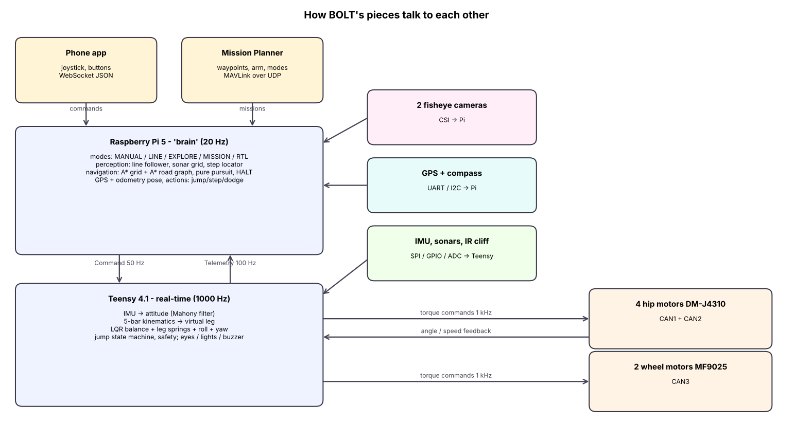

# The BOLT guide — how this robot was designed, explained from zero

This guide is for someone who has **never built a robot like this**. It explains *why* every decision was made, the physics behind it, how the mechanism moves, how the simulation was set up, how the design was improved step by step, how the electronics work and how every piece of code works. You don't need to read the code first: each chapter points to the exact files when you're ready.

The reference documents in `docs/01…06` are the short "what and how to build it" version. This guide is the long "why and how does it work" version.

| # | Chapter | You will learn |
|---|---|---|
| 1 | [How the project was made](01_how_it_was_made.md) | the whole process from a wish list to a tested design — the order to do things in, and why |
| 2 | [The physics](02_physics.md) | why a two‑wheeler falls, how it balances, the maths of LQR in plain words, slopes, turning, jumping, motors |
| 3 | [The mechanism and linkages](03_mechanism.md) | the 5‑bar leg joint by joint, forward/inverse kinematics with real numbers, how motor torque becomes leg force, structure and materials |
| 4 | [The CAD](04_cad.md) | how the parts are generated by code, how each part is shaped and why, print orientation, mass and centre of mass |
| 5 | [The simulation and the iterations](05_simulation.md) | MuJoCo basics, how the robot model is built, how the controller was designed from it, the 15 tests, the V1→V3 story and every bug the tests caught |
| 6 | [The electronics](06_electronics.md) | power, batteries, fuses, CAN bus, SPI, USB, I²C, PWM, voltage dividers — with the actual numbers used here |
| 7 | [The code](07_code.md) | a walkthrough of the firmware, the controller, the Raspberry Pi brain, the app and the tests, plus "recipes" for changing things |
| 8 | [Glossary and learning path](08_glossary.md) | every term used in this repository, and what to study in which order |

All figures in `docs/guide/img` are regenerated by `python3 docs/guide/make_figures.py`.
